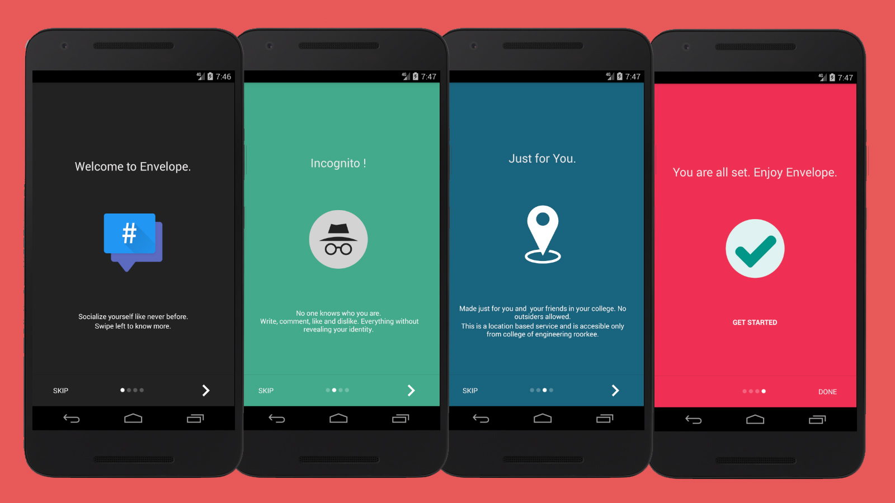

# envelope-android-app

Envelope is a Anonymous Text Posting website for College Students. 
This repository has the code for the Android App

## Intro screen



## SplashScreen


## Contributors
	
1. Ishan Jain([@ishanjain28](https://github.com/ishanjain28))
2. Mrinal Raj([@mrinalraj](http://github.com/mrinalraj))
3. Pankaj Dagar

## Resources

```gradle
    dependencies {
        compile 'com.github.apl-devs:appintro:v4.2.2'
        compile 'com.miguelcatalan:materialsearchview:1.4.0'
    }
```
com.github.paolorotolo.appintro([repo](https://github.com/apl-devs/AppIntro))

com.miguelcatalan.materialsearchview([repo](https://github.com/MiguelCatalan/MaterialSearchView))